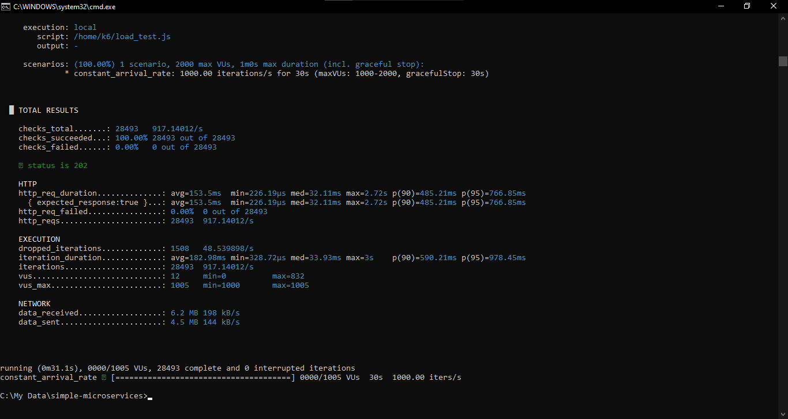

### Simple Microservices

This project is a solution for the Fullstack Developer Test Challenge, which demonstrates proficiency in building a small microservice-based application using **NestJS** and **Golang**.

-----

### Project Overview

The application consists of two main microservices that communicate asynchronously via RabbitMQ:

1.  **`product-service` (NestJS)**: Manages product data, including stock levels and pricing. It features caching with Redis to handle frequent data access.
2.  **`order-service` (Golang)**: Manages order creation and processing. It communicates with the `product-service` to validate and reduce product stock.

-----

### Key Technologies

  * **Backend Frameworks**: NestJS (for `product-service`) and Golang (for `order-service`).
  * **Database**: PostgreSQL / MySQL (configured via environment variables).
  * **Caching**: Redis, used for caching product data in the `product-service`.
  * **Asynchronous Communication**: RabbitMQ, used for event-driven communication between services.
  * **Containerization**: Docker and Docker Compose for easy setup and deployment.
  * **Testing**: Comprehensive unit tests for key services to ensure logic is working as expected.

-----

### Services & Functionality

#### `product-service` (NestJS)

  * **CRUD Operations**: Provides endpoints for creating, retrieving, updating, and deleting products.
  * **Caching**: Caches product data by ID using Redis to speed up read operations. The cache is invalidated on create, update, and delete actions.
  * **Stock Management**: Contains a `reduceStock` method that reduces product quantity based on an order request.

#### `order-service` (Golang)

  * **Order Creation**: Creates a new order by fetching product information (via an event) and publishing an event to reduce the stock.
  * **Concurrency**: Designed to handle a high volume of requests (e.g., 1000 requests/second) by asynchronously processing events.

-----

### How to Run the Project Locally

To set up and run all services using Docker Compose, follow these steps:

1.  **Clone the repository:**

    ```bash
    git clone [your-repo-url]
    cd [your-repo-folder]
    ```

2.  **Configure environment variables:**
    Create a `.env` file in the project's root directory based on the provided `.env.example` file.

    ```bash
    cp .env.example .env
    ```

    You can then edit the `.env` file if you need to change the default values.

3.  **Start all services:**

    ```bash
    docker-compose up --build
    ```

    This command will build the Docker images for both services and start all containers, including RabbitMQ and Redis.

4.  **Access the services:**

      * **`product-service`**: `http://localhost:3000`
      * **`order-service`**: `http://localhost:8080`

5.  **Stop the services:**

    ```bash
    docker-compose down
    ```

-----

### API Documentation

To see full documentation please access this link:
https://documenter.getpostman.com/view/7111568/2sB3HtFHEY

  * **Product Endpoints**:
      * `POST /products`: Create a new product.
      * `GET /products/:id`: Get a product by ID (cached).
  * **Order Endpoints**:
      * `POST /orders`: Create a new order.

-----

### Testing

Each service contains comprehensive unit tests to ensure all business logic functions correctly.

  * **Run NestJS tests (`product-service`):**
    ```bash
    cd product-service
    npm run test
    ```
* **Run Go tests (`order-service`):**
    ```bash
    cd order-service
    go test ./...
    ```

### Load Testing

To test overall system performance under heavy load, you can use k6. Make sure all services are running:

* **Run Perfomance Test**:
    ```bash
    docker-compose run --rm k6 run /home/k6/load_test.js
    ```

Example test result:

